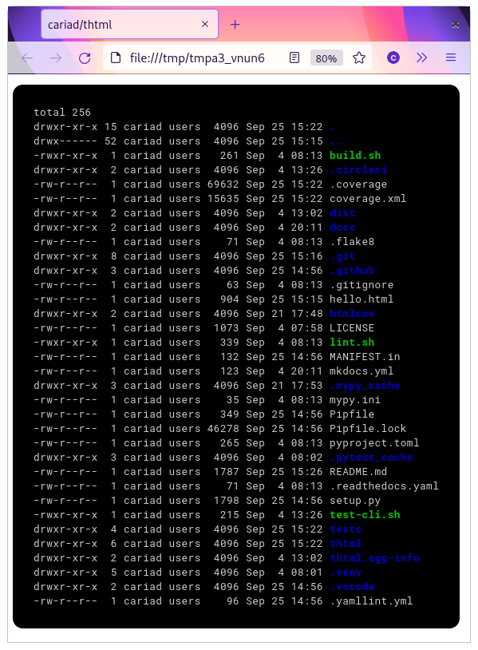

# thtml

`thtml` (**t**o **HTML**) is a CLI tool and Python package for converting text to HTML.

For example, to pipe a command through `thtml`:

```bash
ls -al --color | thtml
```

```html
<!doctype html><html>...</html>
```

Include `--open` to send the HTML directly to your default browser:

```bash
ls -al --color | thtml --open
```



## Installation

`thtml` requires Python 3.8 or later.

```bash
pip install thtml
```

## Feedback

Please raise bugs, request features and ask questions at [github.com/cariad/thtml/issues](https://github.com/cariad/thtml/issues).

Mention if you're a [sponsor](https://github.com/sponsors/cariad) to ensure I respond as a priority. Thank you!

## Project

The source for `thtml` is available at [github.com/cariad/thtml](https://github.com/cariad/thtml) under the MIT licence.

And, **hello!** I'm [Cariad Eccleston](https://cariad.io) and I'm an independent/freelance software engineer. If my work has value to you, please consider [sponsoring](https://github.com/sponsors/cariad/).
